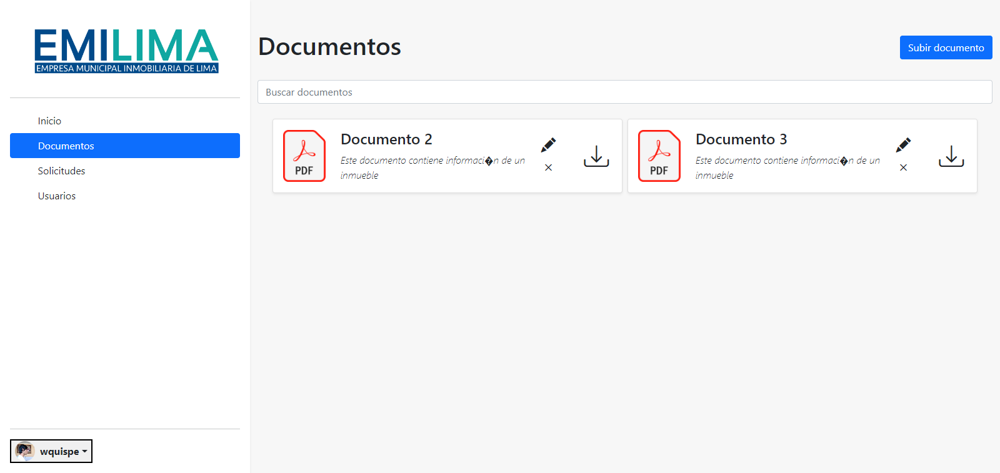

# emilima



This project is made based in contents of ADS 1 and it's supposed to be documented with UML and the best practices of AUP. All these knowledge is going to be implemented to make a system for Emilima (Empresa Municipal Inmobiliaria de Lima)

## Team members

- RONALD PALOMINO ALIAGA
- WALTER MIGUEL ANGEL PASCUAL ORTIZ
- JUAN LUIS	BAYGORREA VILLALBA
- FACUNDO MIGUEL FLORES SALVATIERRA
- WILMER ANDRES QUISPE GOMEZ

## Libraries to have

- commons-io-2.11.0
- dotenv-java-2.2.2
- gson-2.9.0
- jstl
- mysql-connector-java-8.0.29
- standard

## Configuration of the environment variables

Go to your personal directory (in Windows `cd C:\Users\[your-username]`, in Linux `cd ~`), create a `.env` file and add the following properties:

``` bash
MYSQL_DB_URL=[your-mysql-url]
MYSQL_DB_USER=[your-mysql-user]
MYSQL_DB_PASSWORD=[your-mysql-password]
```

## Adding file-uploads folder
One thing that you can't forget when stablishing this project into your computer is to have an file-uploads folder, simply you create a new folder into your personal directory (in Windows `mkdir file-uploads`, in Linux it's the same) and that's all, the system will upload all documents and images into it.